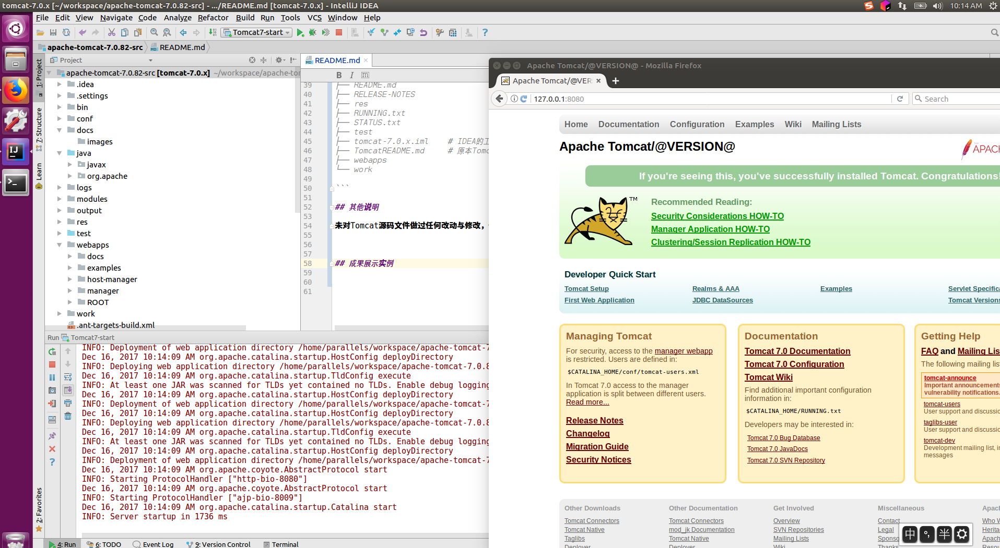

# tomcat7.0.82-codeview

对Tomcat7.0.82版本的源码查看笔记,毕竟水平也是臭的，积累一点是一点，能坚持多少是多少，也不会刻意的去读源码，工作中遇到问题了有时间了就去翻一下，落实一下问题点。因为个人没有什么代码经验， 所以只谈问题解决步骤与过程方法，不谈论设计模式等等的问题。


##  一、基本环境信息

本工程是在`Ubuntu Linux`桌面环境下完成(因为这个发行版本下一个IDE的运行个人觉得比较稳定,如果出现了问题相关资料还是比较多的)，但是本人也实践过在`Windows`下同样实用，使用者可以直接`git clone`本仓库，按照文档的说明操作即可完成本机的搭建工作，所需环境信息如下：

- 1、 Ant版本 `Apache Ant(TM) version 1.9.4`
- 2、`JDK`版本 需要两个版本（`JDK1.6`和`JDK1.7`）
- 3、 翻墙工具(非必须因为我试了一下不翻墙是可以build成功的，但是速度慢的出奇)
- 4、 `Intellij IDEA Community  Edition` （最新的版本即可，不要什么企业版，当然`Tomcat官方`首页中推荐的`IDE`为`eclipse`，但是因为我觉得`eclipse`太卡了，所以就直接用的`IDEA`(请设置好微软雅黑的字体，不然编译器里面都是中文的黑方块)，工具不限，只要按照要求配置即可搭建好环境）


## 二、工程目录结构

如下所示，若无特殊说明都是`Tomcat`官方原本自带的文件，本人未经过任何修改或者删除文件（毕竟也没有那个水平）


```bash
parallels@parallels-vm:~/workspace/apache-tomcat-7.0.82-src$ tree -L 1
.
├── bin
├── BUILDING.txt
├── build.properties
├── build.properties.default
├── build.xml
├── conf
├── CONTRIBUTING.md
├── java #源码目录
├── KEYS
├── LICENSE
├── logs
├── modules
├── NOTICE
├── output
├── README.md
├── RELEASE-NOTES
├── res
├── RUNNING.txt
├── STATUS.txt
├── test
├── tomcat-7.0.x.iml    # IDEA的工程文件，在.gitignore文件已经忽略
├── TomcatREADME.md     # 原本Tomcat的README文件
├── webapps
└── work

```

## 三、其他说明

未对Tomcat源码文件做过任何改动与修改，也没有加入什么特殊的辅助编译脚本。阅读笔记的源码步骤等文件在`docs`文档目录中。


## 四、成果展示实例




## 五、 笔记目录


笔记目录请查看项目上的`Wiki`目录


