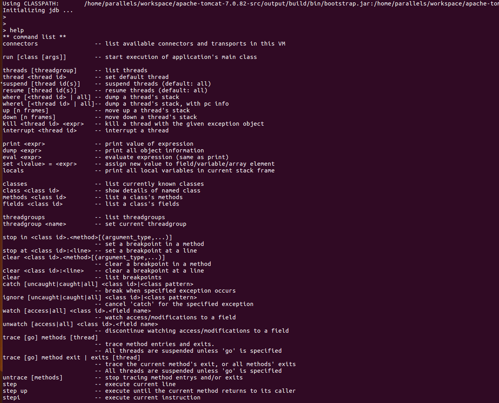
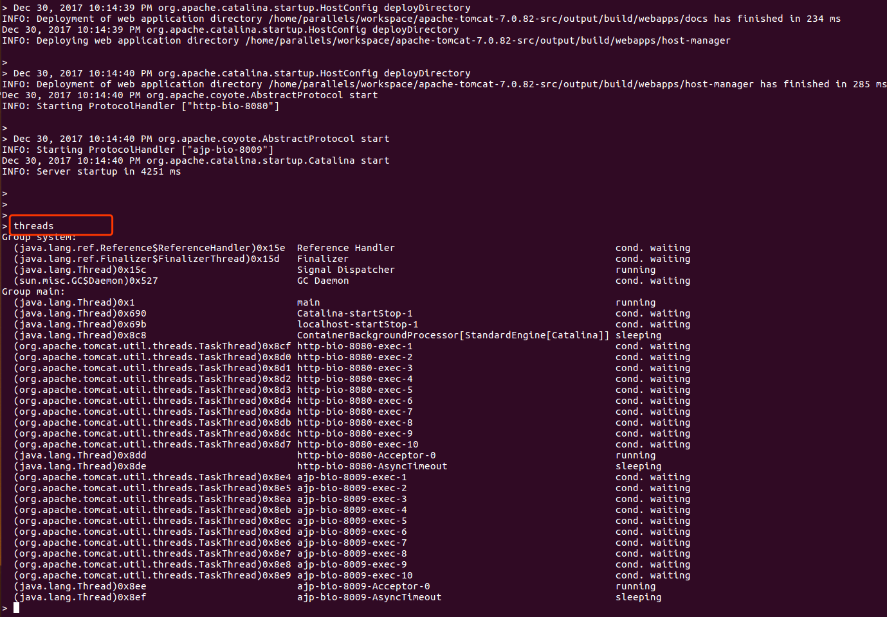

#  Tomcat的启动脚本解析

本节主要介绍`Tomcat`官方的启动脚本执行过程，进行跟踪启动一个`Tomcat`启动的过程， 目前笔者见到的启动`Tomcat`的方法主要有两种一种是使用官方的启动脚本`startup.sh`，另外一种是使用`java wrapper service`
两者各有好处，官方的么应该所有的人都觉的会比较靠谱点，对于`Tomcat`启动时依赖的变量或者设置应该是比较全面的但是貌似官方未提供`Linux`的服务启动配置，`java wrapper service`其实就是一个包装器，
它可以实现是将任何的`Java`程序包装成一个操作系统的服务去运行，只要告诉它去运行什么类就可以了。

--------------------

## 一、 Tomcat的启动脚本

启动脚本位于下载的`bin`文件夹下，点开`startup.sh`是`linux`下的启动脚本，`startup.bat`是`windows`下的启动脚本。由于大多数的环境下我们使用
`linux`环境，所以以linux环境为例。该文件做的事情很简单，就是判断操作系统类型，定位`catalina.sh`文件，然后调用`catalina.sh`，并传入参数，
第一个参数固定为`start` ，第二个参数为执行`start.sh`时所有的参数。转战`catalina.sh`查看这货给我们干了什么，脚本开头还是做一些操作系统的兼容
性，注意观察如下部分，脚本检查当前的变量中是否存在`CATALINA_HOME`变量，如果不存在就把当前的脚本所在的上层目录即`tomcat的bin目录同层`目录作为其值。
```bash

# Only set CATALINA_HOME if not already set
[ -z "$CATALINA_HOME" ] && CATALINA_HOME=`cd "$PRGDIR/.." >/dev/null; pwd`

# Copy CATALINA_BASE from CATALINA_HOME if not already set
[ -z "$CATALINA_BASE" ] && CATALINA_BASE="$CATALINA_HOME"

# Ensure that any user defined CLASSPATH variables are not used on startup,
# but allow them to be specified in setenv.sh, in rare case when it is needed.
CLASSPATH=

if [ -r "$CATALINA_BASE/bin/setenv.sh" ]; then
  . "$CATALINA_BASE/bin/setenv.sh"
elif [ -r "$CATALINA_HOME/bin/setenv.sh" ]; then
  . "$CATALINA_HOME/bin/setenv.sh"
fi
```
然后清空一下当前的`CLASSPATH`，而且脚本里面也说了如果我们想特殊设置`CLASSPATH`变量需要在`setenv.sh`中设置，类似给了一个自定义发挥的地方，你要什么CLASSPATH自己在里面配置好了

```bash
# Add on extra jar files to CLASSPATH
if [ ! -z "$CLASSPATH" ] ; then
  CLASSPATH="$CLASSPATH":
fi
CLASSPATH="$CLASSPATH""$CATALINA_HOME"/bin/bootstrap.jar

if [ -z "$CATALINA_OUT" ] ; then
  CATALINA_OUT="$CATALINA_BASE"/logs/catalina.out
fi

if [ -z "$CATALINA_TMPDIR" ] ; then
  # Define the java.io.tmpdir to use for Catalina
  CATALINA_TMPDIR="$CATALINA_BASE"/temp
fi

# Add tomcat-juli.jar to classpath
# tomcat-juli.jar can be over-ridden per instance
if [ -r "$CATALINA_BASE/bin/tomcat-juli.jar" ] ; then
  CLASSPATH=$CLASSPATH:$CATALINA_BASE/bin/tomcat-juli.jar
else
  CLASSPATH=$CLASSPATH:$CATALINA_HOME/bin/tomcat-juli.jar
fi
```
在往下就更加简单了，如果`setenv.sh`中配置了`CLASSPATH`变量就在变量中追加`bootstrap.jar`和`tomcat-juli.jar`，设置日志输出文件位置，设置`java.io.tmp`目录，这里之前有遇见过线上的环境由于修改了这个
`tmp`目录为操作系统的根目录，导致操作系统中文件莫名的少文件的事故，所以要当心。在往下跑就是在拼接其他的启动参数了，拼接了`log`模块的日志输出配置文件等。
```bash

 . "$CATALINA_HOME"/bin/setclasspath.sh  #主要实现根据环境变量的配置找到java命令
    
   
if [ -z "$JSSE_OPTS" ] ; then
  JSSE_OPTS="-Djdk.tls.ephemeralDHKeySize=2048"
fi
JAVA_OPTS="$JAVA_OPTS $JSSE_OPTS"

# Set juli LogManager config file if it is present and an override has not been issued
if [ -z "$LOGGING_CONFIG" ]; then
  if [ -r "$CATALINA_BASE"/conf/logging.properties ]; then
    LOGGING_CONFIG="-Djava.util.logging.config.file=$CATALINA_BASE/conf/logging.properties"
  else
    # Bugzilla 45585
    LOGGING_CONFIG="-Dnop"
  fi
fi

if [ -z "$LOGGING_MANAGER" ]; then
  LOGGING_MANAGER="-Djava.util.logging.manager=org.apache.juli.ClassLoaderLogManager"
fi
```

拼接完成这些参数后就作为`JVM`的启动参数，启动时运行`org.apache.catalina.startup.Bootstrap` 这个类即可。
```bash
"\"$_RUNJAVA\"" "\"$LOGGING_CONFIG\"" $LOGGING_MANAGER $JAVA_OPTS $CATALINA_OPTS \
      -Djava.endorsed.dirs="\"$JAVA_ENDORSED_DIRS\"" -classpath "\"$CLASSPATH\"" \
      -Djava.security.manager \
      -Djava.security.policy=="\"$CATALINA_BASE/conf/catalina.policy\"" \
      -Dcatalina.base="\"$CATALINA_BASE\"" \
      -Dcatalina.home="\"$CATALINA_HOME\"" \
      -Djava.io.tmpdir="\"$CATALINA_TMPDIR\"" \
      org.apache.catalina.startup.Bootstrap "$@" start

```
至此一个Tomcat即可启动完毕，查看脚本后我们可以知道官方给我们提供了调试等等的功能，例如以如下命令启动
```bash
Shell> ./catalina.sh debug

Using CATALINA_BASE:   /home/parallels/workspace/apache-tomcat-7.0.82-src/output/build
Using CATALINA_HOME:   /home/parallels/workspace/apache-tomcat-7.0.82-src/output/build
Using CATALINA_TMPDIR: /home/parallels/workspace/apache-tomcat-7.0.82-src/output/build/temp
Using JAVA_HOME:       /opt/jdk1.7.0_80/
Using CLASSPATH:       /home/parallels/workspace/apache-tomcat-7.0.82-src/output/build/bin/bootstrap.jar:/home/parallels/workspace/apache-tomcat-7.0.82-src/output/build/bin/tomcat-juli.jar
Initializing jdb ...

```
启动后可以使用help命令查看支持那些命令。官方为我们提供了一些命令，如下图所示


我们可以通过`threads`命令查看当前的运行的线程信息，和`jstack` 的功能类似。在进一步，我们可以发现其实这个工具的实质就是使用`jdb`命令去启动`JVM`，详细的使用方法可以后续在调研




