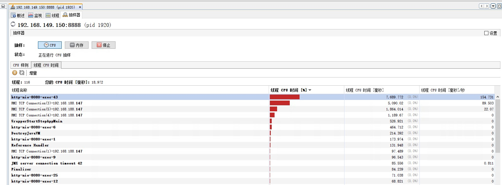
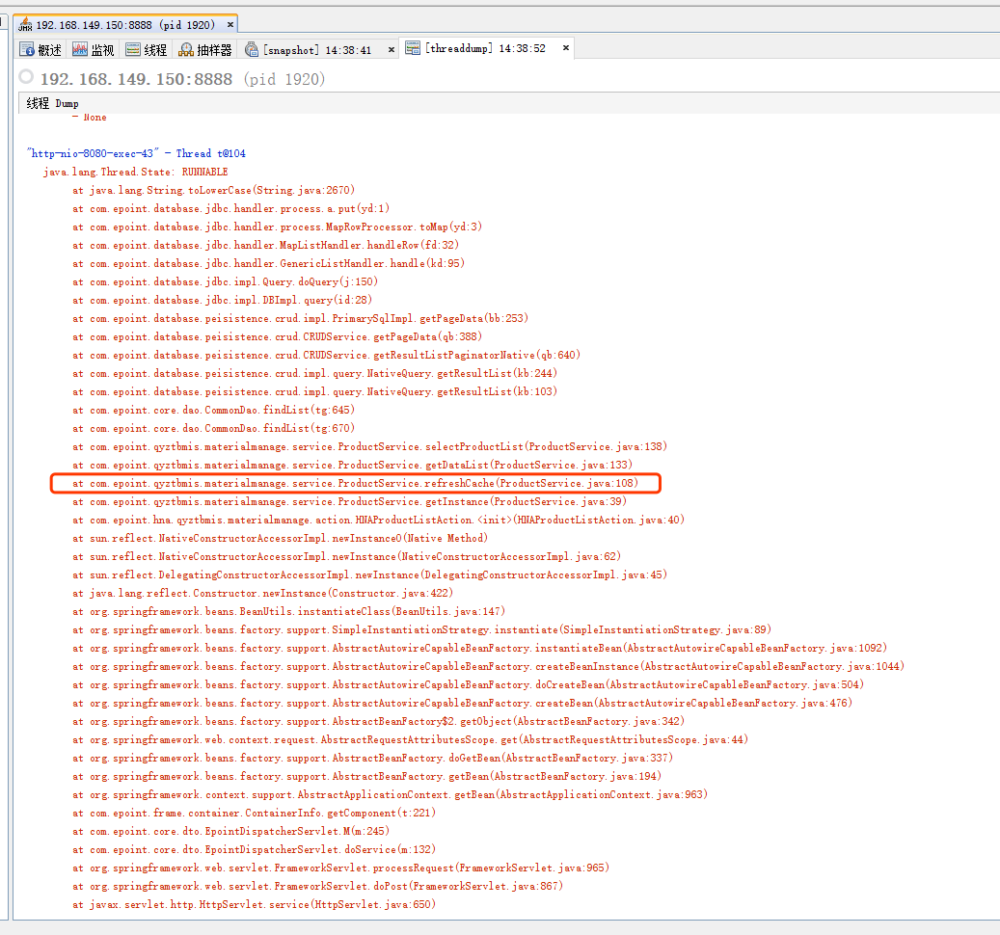
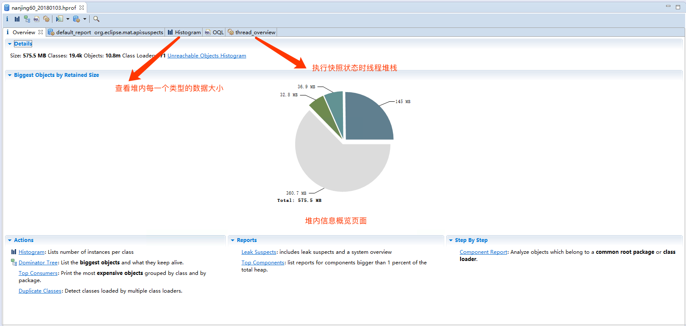
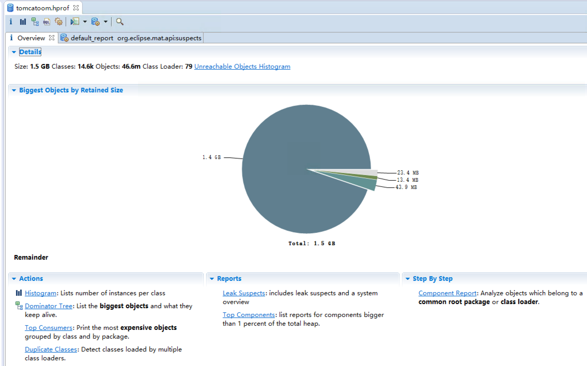
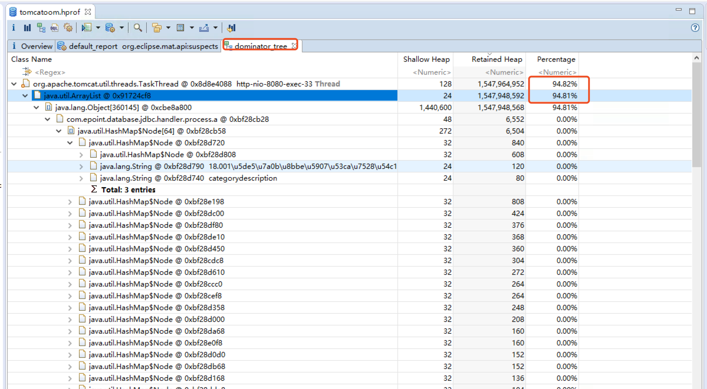

# 线上诊断Tomcat的问题-工具与方法

本篇主要讲解一些介绍`Tomcat`线上问题诊断方法，以及诊断工具的使用。每一个问题场景下都有自己的问题，本篇只是介绍收集线上问题的一般步骤与排查的套路。

----------------


## 一、工具箱介绍

目前笔者使用过的有成功案例的工具主要是`JDK`本身还有就是`MemoryAnalyzer`前者主要是收集以及查看线上JVM的信息，后者主要是对JVM的内存进行分析。

### 1.1、 JDK自带的工具 

在JDK中官方原生就提供了很多的工具给我们获取到正在运行的JVM状态的工具，由于线上的系统使用的JRE，所以在使用是需要我们先在线上的环境上配置JDK，如果是Linux的系统其实只要在当前Shell中export变量即可，使用完成后再删掉JDK即可，如果是Windows，自求多福，再`cmd.exe(使用对应的JVM启动用户身份运行)`中使用`set`命令临时添加即可，但是笔者在有的项目上实验有事会不成功。在JDK的工具中，笔者尝试用到的命令主要是`jps`、`jmap`、`jstack`、`jinfo`、`jstat`，当然还有一些可视化的工具辅助我们进行查看，比如`jvisualvm`和`jmc(java飞行记录器，这个也是JDK后来的推出的工具)`,这些可视化的工具都需要重启JVM，所以一般情况下笔者很少使用，或者问题发现很频繁的话可以开启调试一下。


对该[工具的使用说明可以官网上获取到](https://docs.oracle.com/javase/7/docs/technotes/tools/)或者[查看这里](http://www.oracle.com/technetwork/java/javase/toc-135973.html),也可以查看本篇的`JDK-Tools的使用介绍`


### 1.2、 MemoryAnalyzer

该工具主要是对内存快照文件进行分析，该工具会是自动的协助我们，找到内存上占用量比较大的对象以及问题。工具可以从[此处下载到](http://fdoc.epoint.com.cn:3366/eclipse/MemoryAnalyzer-1.7.0.20170613-win32.win32.x86_64.zip)，
通过该工具我们可以查看到当前的JVM堆栈中大对象以及线程信息等等。


## 二、明确目标

在诊断问题前，先要明确问题，你要查找的问题是`CPU`问题还是`内存`问题，如果是内存问题则首选的方法先让系统跑一段时间，然后等待使用内存飙升上去了之后打出一个内存快照出来，使用`MemoryAnalyzer`进行分析即可，如果是调试`CPU`或者线程阻塞的问题的，则倾向于使用`jstack`的方法，打出当前运行的堆栈快照。查看线程状态为`WAITTING`或者`LOCKED`的即可。工具方法有很多种，但是思路(套路)是最重要的。

## 三、 调试线程阻塞或者CPU过高的问题

对于`CPU`问题通常情况下，我们应该很容易可以复现的，所以我们可以直接在`JVM`的启动参数中加入`-Dcom.sun.management.jmxremote.port=8888 -Dcom.sun.management.jmxremote.ssl=false -Dcom.sun.management.jmxremote.authenticate=false  -Djava.rmi.server.hostname=192.168.1.51`，加入该段参数后`JVM`会在本机的`8888`端口上启动一个监听，我们可以使用`JMX`工具连接进来查看与诊断问题。当`CPU`撑满时，我们可以使用`JDK`自带的`jvisualvm`工具连接进入`JVM`，在抽样器中点击`CPU`抽样，获取到使用的`CPU`使用量最高线程名称，如下图所示，`http-nio-8080-exec-43`该线程中运行的代码就是我们要找的`CPU`占用比较高的幺蛾子代码了，在`【线程】视图`点击`【线程Dump】`就可以查看当前的JVM中运行的代码堆栈，找到对应名字的内容即可查看到代码块。



如下图所示，我们可以定位到当前的代码块。



找到代码块了，下面的问题也就简单了。


上面介绍了来自官方亲儿子的方法,下面介绍几个民间方法，由于本人只是在测试系统上有一定的测试经验，所以不做详细的介绍，给出[Github的官方地址后续使用在对比](https://github.com/aragozin/jvm-tools)


## 四、 调试内存问题

对于`内存`问题一般我们会使用先使用压力测试工具，或者其他手段将内存撑满，先还原现象，在使用`jmap`工具将`JVM`内存进行`DUMP`出来，使用`MemoryAnalyzer`工具对内存文件进行分析，我们以某一个项目上的具体为题为例子，阐述如何使用该工具，首先站在全局的角度来介绍一下`MemoryAnalyzer`的功能与基本使用方法。首先打开堆快照文件，工具会自动分析技术快照内的类对象数量。



如上图所示，`MemoryAnalyzer`工具为我们提供了几个功能

- `Overview:` 是一个总的分析预览，其中我们比较感兴趣的是中间的饼图，我们可以快速的知道当前的堆中有那些比较大的对象。
- `Histogram:` 该视图是按照类名称将每一个类在堆中占用的大小统计出来
- `thread_overview:` 该视图显示的是在执行堆栈快照时运行的线程状态，一般情况下我们可以在里面找到我们的业务程序代码，但是你找快照的时候巧了都是在执行`Tomcat`的代码，你可以在多照几次，不要觉得都是`Tomcat`代码就不是你的问题
- `dominator_tree:` 该视图提供堆栈中按照对象进行划分，我们在这个视图里面可以查看到每一类对象的大小占比。

该页面中暂时我们比较关心的内容大致如上，实际在分析的时候往往是在多个视图之间进行对比与查看才能够得出结论。


现在我们以实际的例子来说明一下如何使用`MemoryAnalyzer`使用，

> 如果发现`MemoryAnalyzer`打开堆栈内存比较卡或者报错的话，可以修改安装目录下`MemoryAnalyzer.ini`文件中的`-Xmx2048m`参数，配置大一点即可。





从图中我们可以看到一个巨大的对象，在堆中占用了`1.4G`内容，我们可以在`dominator_tree`视图中找到如下图所示占用对象的最多的其实是一个`Arraylist`对象，再往下点即可查看到对象中的内容，此时上心的开发应该可以忽然明朗到为何会加载到这么多的大对象，由于堆栈中涉及到公司的业务机密，所以这里不再展开叙述。




## 五、 JVM Crash日志

除了以上的排查工具其实在平时的线上系统中，我们还会看到JVM自生由于意外终止而产生的文件，比较常见就是`hs_err_pidxxx.log`，该文件是由于`JVM`出现意外终止的到生成的，在该文件中我们可以获取到例如`JVM Crash`问题的原因以及出现问题时线程快照。为了演示结合说明，我们以实际项目上遇见的例子介绍一下我们可以从中获取到的信息。[文件可以从此处获取到](others/hs_err_pid37100.log),首先我们要明确出现该问题的原因一般是由于`JVM 自身的bug`,`应用程序错误`,`服务器资源不足`,`JNI 调用错误`等。该文件的生成位置可以使用`JVM的-XX:ErrorFile`参数指定，例如`-XX:ErrorFile=../logs/hs_err_pid<pid>.log`,下面我们以示例文件中的内容来说明一下我们可以获取到信息。


### 5.1、 日志头文件(概述了为何出现JVM Crash)

```bash
#
# There is insufficient memory for the Java Runtime Environment to continue.
# Native memory allocation (malloc) failed to allocate 32744 bytes for ChunkPool::allocate
# Possible reasons:
#   The system is out of physical RAM or swap space
#   In 32 bit mode, the process size limit was hit
# Possible solutions:
#   Reduce memory load on the system
#   Increase physical memory or swap space
#   Check if swap backing store is full
#   Use 64 bit Java on a 64 bit OS
#   Decrease Java heap size (-Xmx/-Xms)
#   Decrease number of Java threads
#   Decrease Java thread stack sizes (-Xss)
#   Set larger code cache with -XX:ReservedCodeCacheSize=
# This output file may be truncated or incomplete.
#
#  Out of Memory Error (allocation.cpp:273), pid=37100, tid=0x000000000000af74
#
# JRE version: Java(TM) SE Runtime Environment (8.0_101-b13) (build 1.8.0_101-b13)
# Java VM: Java HotSpot(TM) 64-Bit Server VM (25.101-b13 mixed mode windows-amd64 compressed oops)
# Failed to write core dump. Call to MiniDumpWriteDump() failed (Error 0x800705af: Ò³ÃæÎļþ̫С£¬ÎÞ·¨Íê³É²Ù×÷¡£
)
#
```

日志概要信息中我们可以获取到出现问题时可能导致我们的`JVM Crash`的问题点，`he system is out of physical RAM or swap space`说明`JVM`在申请堆内存时操作系统层面就已经无法在分配出内存了将`JVM`进行了`Kill`，当然他也给了我们一定的提示以及解决方案例如调大内存等等。

有时我还在有的项目中看见类似如下输出

```bash
# A fatal error has been detected by the Java Runtime Environment:
#
# EXCEPTION_STACK_OVERFLOW

```

该描述表示这是个栈溢出导致的错误，这往往是应用程序中存在深层递归导致的，其实此时应该去解决是否真的自己的`try cash`模块包裹的太多了，导致堆栈深度太高了,又或者是你本身对方法的递归迭代调用太多了，而不是简单的通过`Xss`参数去规避问题


### 5.2、 导致Crash的线程信息


报错日志再往下我们可以看见的内容是导致此次`Crash`的线程信息，从中我们可以找到线程名以及线程编号信息，在这里我们需要注意不要简单的下结论出现问题的线程就是罪魁祸首，因为他可能只是很单纯的想申请一个内存而已。我们要分析的点还是为何会出现问题。


```bash
---------------  T H R E A D  ---------------
Current thread (0x00000000577cc000):  VMThread [stack: 0x00000000587a0000,0x00000000588a0000] [id=44916]

Stack: [0x00000000587a0000,0x00000000588a0000]
[error occurred during error reporting (printing stack bounds), id 0xc0000005]

Native frames: (J=compiled Java code, j=interpreted, Vv=VM code, C=native code)

VM_Operation (0x00000000695bd940): BulkRevokeBias, mode: safepoint, requested by thread 0x0000000058cb3000


```

### 5.3、 线程信息


在往下其实就是我们出现问题时线程的快照(其实里面就是记录了当前`Tomcat`的线程状态).


```bash

---------------  P R O C E S S  ---------------

Java Threads: ( => current thread )
  0x00000002e77d4800 JavaThread "WebSocketServer-/GXAJOA-6483" daemon [_thread_blocked, id=28120, stack(0x0000000311370000,0x0000000311470000)]
  0x00000002e77d3800 JavaThread "WebSocketServer-/GXAJOA-6482" daemon [_thread_blocked, id=139924, stack(0x00000003114b0000,0x00000003115b0000)]
  0x00000002e77d3000 JavaThread "WebSocketServer-/GXAJOA-6481" daemon [_thread_blocked, id=38348, stack(0x0000000310ab0000,0x0000000310bb0000)]
  0x00000002e77d2000 JavaThread "WebSocketServer-/GXAJOA-6480" daemon [_thread_blocked, id=24112, stack(0x0000000311250000,0x0000000311350000)]
  0x00000002e77d1800 JavaThread "WebSocketServer-/GXAJOA-6479" daemon [_thread_blocked, id=62488, stack(0x0000000311140000,0x0000000311240000)]
  0x00000002e77d0800 JavaThread "WebSocketServer-/GXAJOA-6478" daemon [_thread_blocked, id=91176, stack(0x0000000311030000,0x0000000311130000)]

```

我们依次介绍一下里面的东西 
 
 
 
 - 第一列的内容`0x00000002e77d4800`是堆栈指针，讲实话个人觉得是没有啥用的，因为没有`jdb`工具的前提下告诉你内存指针地址也米有什么用

 - 第二列的内容`JavaThread`，该列指明当前线程是属于什么类型的线程，说白了就是干什么活的线程，可能包含如下内容
  
  - `JavaThread：` Java线程

  - `VMThread：` JVM内部线程

  - `CompilerThread:` 及时编译装载卸载class的线程

  - `GCTaskThread:`  我们熟悉的GC线程

 
 - 第三列`WebSocketServer-/GXAJOA-6483` 指明当前的线程名

 - 第四列 `_thread_blocked` 指明当前的线程状态(列举我在项目中看见的内容，详细的每一个可能会出现的值大家可以去查看[官方说明文档](http://www.oracle.com/technetwork/java/javase/felog-138657.html#gbvki))

  - `_thread_in_native` 正在执行本地代码
  - `_thread_in_vm` 正在执行VM代码
  - `_thread_in_Java` 正在执行我们自己写的`Java`代码
  - `_thread_blocked` 当前线程状态为`block`状态，等待某一个运行条件

  以笔者个人经验来看，其实除了`_thread_blocked`和`_thread_in_Java`以外其他线程出现异常了我们更多的应该是去思考是不是我们的使用方式不当导致了`JVM`出现异常现象，因为毕竟`JVM`是近代人类智慧的结晶

 - 第五列 `id=139924` 指明线程编号

 - 第六列 `stack(0x0000000311030000,0x0000000311130000)` 按照官方的说法运行堆栈的地址范围，因为个人在实践中没有实际的操作经历所以不做赘述


以上关于该日志内容的详细文档可以查看[官方文档地址](http://www.oracle.com/technetwork/java/javase/felog-138657.html)


### 5.4、 堆栈信息

```bash
Heap:
 PSYoungGen      total 77312K, used 7370K [0x00000000f0000000, 0x00000000f5500000, 0x0000000100000000)
  eden space 67072K, 0% used [0x00000000f0000000,0x00000000f0026fd0,0x00000000f4180000)
  from space 10240K, 70% used [0x00000000f4b00000,0x00000000f520b860,0x00000000f5500000)
  to   space 9728K, 0% used [0x00000000f4180000,0x00000000f4180000,0x00000000f4b00000)
 ParOldGen       total 442368K, used 424795K [0x0000000080000000, 0x000000009b000000, 0x00000000f0000000)
  object space 442368K, 96% used [0x0000000080000000,0x0000000099ed6e60,0x000000009b000000)
 Metaspace       used 137124K, capacity 149454K, committed 149720K, reserved 1181696K
  class space    used 15117K, capacity 17085K, committed 17152K, reserved 1048576K

Card table byte_map: [0x0000000011ce0000,0x00000000120f0000] byte_map_base: 0x00000000118e0000
```

在往下我们可以获得在`Crash`时堆栈状态，里面记录了年轻代与与老年代以及代码`Metaspace`区的大小信息。


### 5.5、 编译事件信息记录


```bash
Compilation events (10 events):
Event: 70573.429 Thread 0x0000000058cab800 32959   !   3       org.apache.log4j.DefaultThrowableRenderer::render (137 bytes)
Event: 70573.469 Thread 0x0000000058cab800 nmethod 32959 0x00000000041f7ad0 code [0x00000000041f7e20, 0x00000000041f9bf8]
Event: 70573.595 Thread 0x0000000058cab800 32960       3       com.sun.crypto.provider.CounterMode::init (50 bytes)
Event: 70573.596 Thread 0x0000000058cab800 nmethod 32960 0x00000000051bae10 code [0x00000000051bafc0, 0x00000000051bb548]
```


讲道理笔者不知道怎么翻译，但是一般我在线上不是太关心的，因为及时关心了我也没有能力去修改


### 5.6、 GC历史记录

```bash
GC Heap History (10 events):
Event: 70482.899 GC heap before
{Heap before GC invocations=659 (full 5):
 PSYoungGen      total 76288K, used 70880K [0x00000000f0000000, 0x00000000f5500000, 0x0000000100000000)
  eden space 65024K, 100% used [0x00000000f0000000,0x00000000f3f80000,0x00000000f3f80000)
  from space 11264K, 51% used [0x00000000f3f80000,0x00000000f4538040,0x00000000f4a80000)
  to   space 10752K, 0% used [0x00000000f4a80000,0x00000000f4a80000,0x00000000f5500000)
 ParOldGen       total 442368K, used 424012K [0x0000000080000000, 0x000000009b000000, 0x00000000f0000000)
  object space 442368K, 95% used [0x0000000080000000,0x0000000099e132a0,0x000000009b000000)
 Metaspace       used 137106K, capacity 149454K, committed 149720K, reserved 1181696K
  class space    used 15116K, capacity 17085K, committed 17152K, reserved 1048576K
Event: 70482.932 GC heap after

```

记录了近期`JVM`进行`GC`的记录，其实我们可以通过对比前后`GC`后的大小观察是不是`JVM`在正常`GC`的

### 5.7、 系统环境信息

```bash
VM Arguments:
jvm_args: -XX:MaxNewSize=256m -XX:MaxPermSize=512m -Xms256m -Xmx2048m -Djava.library.path=../lib -Dwrapper.key=ykYhN3J9uuhvFEYN -Dwrapper.port=32003 -Dwrapper.jvm.port.min=31000 -Dwrapper.jvm.port.max=31999 -Dwrapper.pid=32572 -Dwrapper.version=3.5.14 -Dwrapper.native_library=wrapper -Dwrapper.service=TRUE -Dwrapper.cpu.timeout=10 -Dwrapper.jvmid=1 
java_command: org.tanukisoftware.wrapper.WrapperSimpleApp org.apache.catalina.startup.Bootstrap 1 start
java_class_path (initial): ../lib/wrapper.jar;bootstrap.jar;tomcat-juli.jar
Launcher Type: SUN_STANDARD

Environment Variables:
PATH=C:\ProgramData\Oracle\Java\javapath;C:\Windows\system32;C:\Windows;C:\Windows\System32\Wbem;C:\Windows\System32\WindowsPowerShell\v1.0\;
USERNAME=QAJJOAWZ$
OS=Windows_NT
PROCESSOR_IDENTIFIER=Intel64 Family 15 Model 6 Stepping 3, GenuineIntel


---------------  S Y S T E M  ---------------

OS: Windows Server 2008 R2 , 64 bit Build 7601 (6.1.7601.23915)

CPU:total 4 (4 cores per cpu, 1 threads per core) family 15 model 6 stepping 3, cmov, cx8, fxsr, mmx, sse, sse2, sse3, popcnt, lzcnt, tsc

Memory: 4k page, physical 8388088k(658236k free), swap 8386228k(4496k free)

vm_info: Java HotSpot(TM) 64-Bit Server VM (25.101-b13) for windows-amd64 JRE (1.8.0_101-b13), built on Jun 22 2016 01:21:29 by "java_re" with MS VC++ 10.0 (VS2010)

time: Fri Jan 05 08:58:13 2018
elapsed time: 70575 seconds (0d 19h 36m 15s)

```

这部分的内容不多说了，就是你当前的环境信息。

